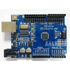
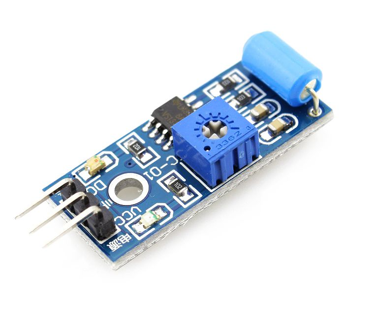
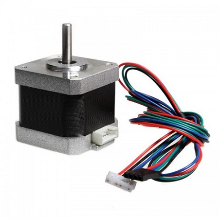
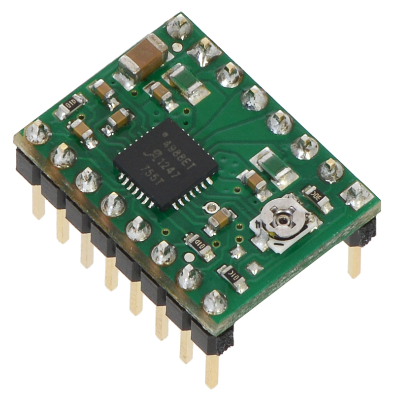
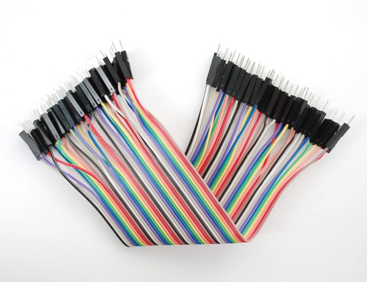
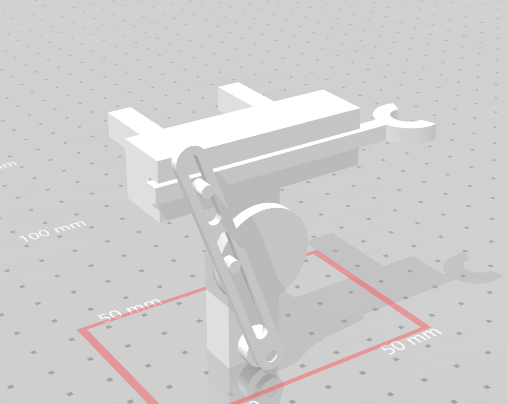
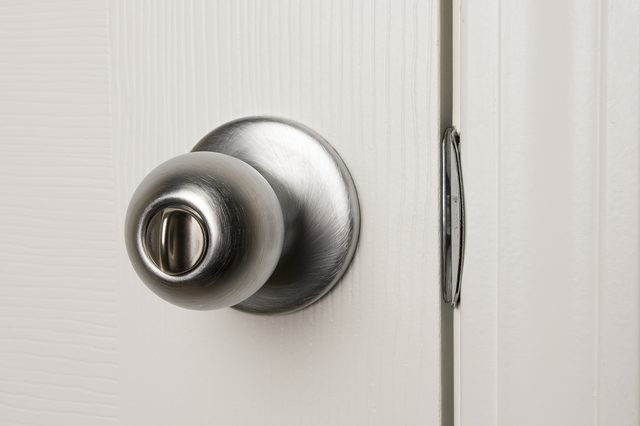

# The-Door-Unlocker

### 💬 Introduction

เนื่องจากมีผู้คนจำนวนไม่น้อยที่มักจะมีนิสัยขี้ลืม ลืมนำกุญแจห้องหรือหอของตนออกไป ขณะมีเหตุจำเป็นต้องไปทำธุระข้างนอกจนเป็นเหตุให้ตน ต้องติดอยู่ภายนอกไม่สามารถเข้าไปในห้องของตัวเองได้ จนกว่าเจ้าหน้าที่หรือบุคคลภายในของหอพักนั้น ๆจะมาทำการเปิดประตูให้ พวกผมจึงได้เกิดความคิดที่ว่าทำยังไงถึงจะช่วยลดปัญหาที่เกิดขึ้นตรงนี้ลงได้ ซึ่งนั้นก็เป็นที่มาของโครงงาน “The Door Unlocker"

---

### 💻 Equipment and Devices

| Arduino UNO R3	 | Vibration sensor SW-420 | Motor 42HB34F08AB | Motor Driver A4988 |
| :--------: | :--------: | :--------: | :--------: | 
|      |   |      |      | 

| Wires | 3D Model | Door Knob Grip Handle | Potentiometer | Buzzer |
| :--------: | :--------: | :--------: | :--------: | :--------: |  
|     |     |   |  |  |

| Arduino nano | NRF24L01 Module | Batteries Box | Batteries |
| :--------: | :--------: | :--------: | :--------: |
|  |  |  | |

---

### 📚 Library

1. NRF24L01 Library [http://www.allarduino.com/download/nRF24L01p.rar](http://www.allarduino.com/download/nRF24L01p.rar)
2. SPI Library [https://www.arduino.cc/en/Reference/SPI](https://www.arduino.cc/en/Reference/SPI)

---

### ☁️ Installation

1. **Download and Install Arduino IDE**
  - Go to https://www.arduino.cc/ and click on **SOFTWARE** menu and select **DOWNLOADS**
  - Select computer's operating system for coding on Arduino IDE.
  - Click on **JUST DOWNLOAD** for download program or **CONTRIBUTE & DOWNLOAD** for donate developer and download program.
  - Unzip the file and run arduino.exe for installation Arduino IDE.

---

### 🔌 How to use

---

### ⚡️ Preview

---

### 🐼 Our Team | สมาชิกกลุ่ม

||||
| :--------: | :--------: | :--------: |
| <b> [@tintinap](https://github.com/tintinap) | <b> [@wannowo](https://github.com/wannowo) | <b> [@jacktnp](https://github.com/jacktnp) |
| <b>Tinnapat Plangsri | <b>Taitana Yumee | <b>Thanapon Wongprasert |
| <b>60070028 | <b>60070029 | <b>60070031 |

---

### 🎓 Instructor | อาจารย์ที่ปรึกษา

||
| :--------: | :--------: |
| <b>ผศ. ดร. กิติ์สุชาต พสุภา | <b>ผศ. ดร. ปานวิทย์ ธุวะนุติ |

---

## 🚀Computer Programming (รหัส 06016315)

#### Faculty of Information Technology 
#### King Mongkut's Institute of Technology  (KMITL)
