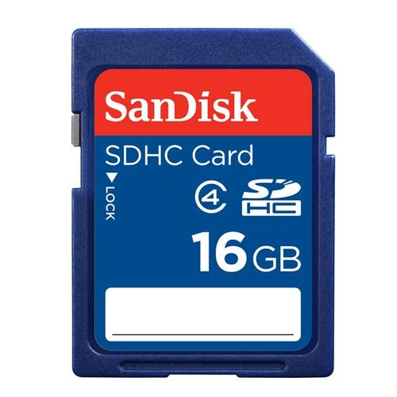

# The-Door-Unlocker

### 💬 Introduction

เนื่องจากมีผู้คนจำนวนไม่น้อยที่มักจะมีนิสัยขี้ลืม ลืมนำกุญแจห้องหรือหอของตนออกไป ขณะมีเหตุจำเป็นต้องไปทำธุระข้างนอกจนเป็นเหตุให้ตน ต้องติดอยู่ภายนอกไม่สามารถเข้าไปในห้องของตัวเองได้ จนกว่าเจ้าหน้าที่หรือบุคคลภายในของหอพักนั้น ๆจะมาทำการเปิดประตูให้ พวกผมจึงได้เกิดความคิดที่ว่าทำยังไงถึงจะช่วยลดปัญหาที่เกิดขึ้นตรงนี้ลงได้ ซึ่งนั้นก็เป็นที่มาของโครงงาน “The Door Unlocker"

---

### 💻 Equipment and Devices

| Arduino UNO R3	 | Vibration sensor SW-420 | Motor 42HB34F08AB | Micro SD Card |
| :--------: | :--------: | :--------: | :--------: | 
|      |   |      |      | 

| Motor Driver A4988 | Wires | 3D Model | Door Knob Grip Handle |
| :--------: | :--------: | :--------: | :--------: |
|      |     |     |   |

---

### 📚 Library

1. SD Library [https://github.com/arduino-libraries/SD](https://github.com/arduino-libraries/SD)
2. SPI Library [https://github.com/arduino-libraries/SD](https://github.com/arduino-libraries/SD)

---

### ☁️ Installation

1. **Download and Install Arduino IDE**
  - Go to https://www.arduino.cc/ and click on **SOFTWARE** menu and select **DOWNLOADS**
  - Select computer's operating system for coding on Arduino IDE.
  - Click on **JUST DOWNLOAD** for download program or **CONTRIBUTE & DOWNLOAD** for donate developer and download program.
  - Unzip the file and run arduino.exe for installation Arduino IDE.

2. **Setting Arduino IDE**
  - Go to File >> Preference, it will show preference window.
  - Pasted http://arduino.esp8266.com/stable/package_esp8266com_index.json in **Additional Boards Manager URLs** and click **OK**.
  
3. **Download and Install Driver**
  - Go to https://www.silabs.com/products/development-tools/software/usb-to-uart-bridge-vcp-drivers.
  - Select computer's operating system for download software.
  - Install the driver on the computer.

4. **Download and Install Library**
  - Go to https://github.com/compro-itkmitl/Sleep-Apnea-Tester/tree/master/Library
  - Download all ZIP file.
  - Open Arduino IDE and select Sketch >> Include Library >> Add .zip library.
  - Select ZIP file and click on "open".

---

### 🔌 How to use

### 🐼 Our Team | สมาชิกกลุ่ม

||||
| :--------: | :--------: | :--------: |
| <b> [@tintinap](https://github.com/tintinap) | <b> [@wannowo](https://github.com/wannowo) | <b> [@jacktnp](https://github.com/jacktnp) |
| <b>Tinnapat Plungsri | <b>Taitana Yuume | <b>Thanapon Wongprasert |
| <b>60070028 | <b>60070029 | <b>60070031 |

---

### 🎓 Instructor | อาจารย์ที่ปรึกษา

||
| :--------: | :--------: |
| <b>ผศ. ดร. กิติ์สุชาติ พสุภา | <b>ผศ. ดร. ปานวิทย์ ธุวะนุติ |

---

## 🚀Computer Programming (รหัส 06016315)

#### Faculty of Information Technology 
#### King Mongkut's Institute of Technology  (KMITL)